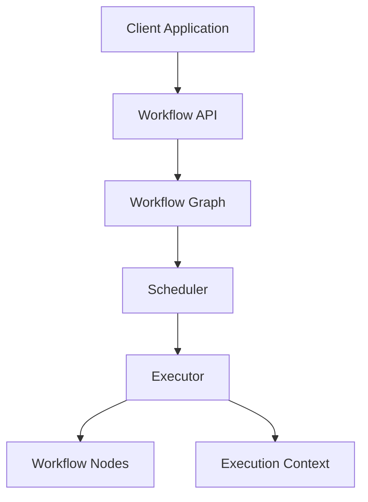

# Architecture

**Note this file is just a placeholder for file structure, and needs an upd with the correct info.**

[← Back to README](../README.md)

## Overview

Brief description of the overall architecture and the main design goals.

Eg:

FlowKit is designed around a modular architecture where workflow definition, graph management, scheduling, and execution are separated into independent components. The goal is to keep the framework extensible and maintainable while ensuring that workflow execution remains independent from the tasks being executed.

---

## High-Level Architecture

Add an overview diagram here.

Eg:

# Core Components

## Workflow

### Responsibility

Provides the public API used by clients to construct workflows and define dependencies between tasks.

### Responsibilities

- Create and configure workflows
- Register workflow nodes
- Define dependencies between nodes
- Provide access to workflow execution

---

## WorkflowGraph

### Responsibility

Manages the internal representation of workflow nodes and their relationships.

### Responsibilities

- Store workflow nodes
- Maintain dependency relationships
- Validate graph structure
- Detect cycles
- Support graph traversal

---

## Scheduler

### Responsibility

Determines the order in which workflow nodes should execute.

### Responsibilities

- Identify executable nodes
- Resolve dependencies
- Produce a valid execution order

---

## Executor

### Responsibility

Coordinates the execution of workflows.

### Responsibilities

- Execute nodes according to the schedule
- Manage execution flow
- Provide runtime context

---

## Context

### Responsibility

Provides shared runtime data between workflow nodes.

### Responsibilities

- Store execution data
- Allow nodes to exchange information
- Maintain workflow state

---

# Design Principles

The architecture is guided by the following principles:

- **Separation of concerns**  
  Each component has a clearly defined responsibility.

- **Single Responsibility Principle (SRP)**  
  Components should have one reason to change.

- **Composition over inheritance**  
  Prefer assembling functionality through composition where appropriate.

- **Dependency Inversion Principle (DIP)**  
  High-level components should depend on abstractions rather than concrete implementations.

- **Testability**  
  Components should be designed to support isolated testing.

- **Extensibility**  
  The architecture should allow new functionality to be added without modifying existing core components.

---

# Design Patterns

The following design patterns naturally emerge from the architecture:

| Pattern | Usage |
|---|---|
| Command | Workflow nodes represent executable tasks |
| Builder | Workflow construction API |
| Strategy | Scheduling algorithms and execution policies |
| Observer | Workflow lifecycle events |
| Dependency Injection | Shared services and runtime dependencies |

[← Back to README](../README.md)