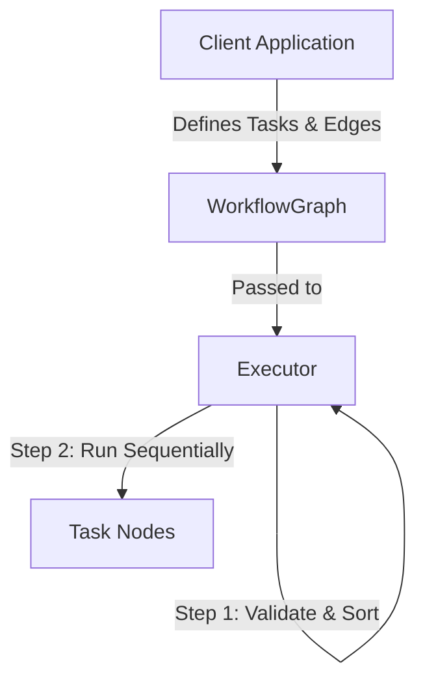
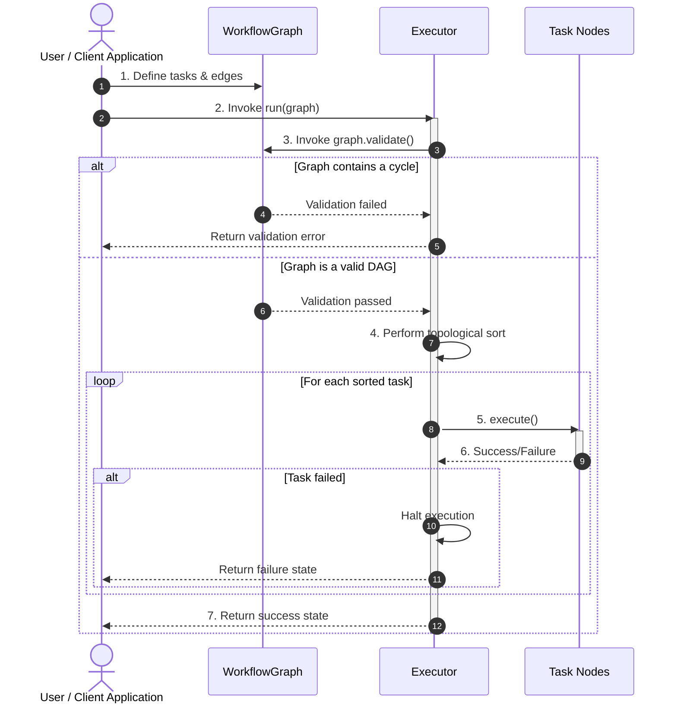

# Architecture

## Overview

FlowKit uses a modular architecture that separates workflow definition from workflow execution. The execution engine is currently single-threaded, while the design preserves the structural guarantees necessary to support a future multi-threaded execution model with minimal architectural changes.

---

## High-Level Component Design

---

## Core Components

### 1. WorkflowGraph

**Responsibility**

- Represents the workflow as a Directed Acyclic Graph (DAG).
- Stores task nodes.
- Maintains directed dependency edges between tasks.
- Exposes a public validation interface (e.g., `bool validate()`) that verifies the graph's structural correctness before execution.

**Validation**

`WorkflowGraph` performs cycle detection using **Kahn's Algorithm**. Execution is only permitted when validation succeeds, guaranteeing that the graph is a valid DAG.

---

### 2. Task

**Responsibility**

Defines the behavioral contract for executable work units.

Rather than requiring inheritance from a common base class, FlowKit accepts any task type that satisfies the required execution interface. This can be enforced through a C++20 Concept (or equivalent template constraint) requiring an `execute()` member function or callable operator.

**Characteristics**

- Provides executable behavior through an `execute()` method or callable operator.
- Completely independent from graph mechanics.
- Tasks have no knowledge of neighboring nodes.
- Supports compile-time polymorphism through templates rather than runtime inheritance.
- Easily extensible for custom task implementations without requiring a framework-specific base class.

---

### 3. Executor

**Responsibility**

Coordinates the complete workflow lifecycle.

**Execution Steps**

1. Accepts a `WorkflowGraph`.
2. Invokes the graph's public validation method (e.g., `graph.validate()`).
3. Performs topological sorting.
4. Executes tasks sequentially.
5. Tracks execution state.
6. Reports execution failures when encountered.

**Additional Responsibilities**

- Acts as the execution orchestrator responsible for localized token or data routing between otherwise independent task nodes.
- Performs any required mapping of task outputs to downstream task inputs while preserving task decoupling and explicit dependency relationships.

The executor owns execution logic while the graph remains a pure structural model responsible for maintaining and validating workflow topology.

---

## System Execution Flow

The following sequence diagram outlines the complete workflow lifecycle—from workflow construction by the client application through graph self-validation, topological sorting, and sequential task execution. The executor preserves encapsulation by invoking the graph's public validation interface and acting solely on the returned validation result.

### High-Level Flow

---

## Design Patterns

| Pattern | Usage | Benefit |
|----------|-------|---------|
| Command | Task abstraction | Encapsulates executable actions behind a consistent interface without exposing framework internals. |
| Builder / Fluent API | Workflow construction | Provides a readable and expressive API for defining workflows and linking task dependencies. |

---

## Architectural Decision: Shared Context

The framework intentionally excludes a global, untyped shared context.

### Rationale

Global mutable state introduces several long-term issues:

- Weakens DAG guarantees.
- Couples otherwise independent tasks.
- Creates data-race risks when introducing parallel execution.
- Makes workflows harder to reason about and test.

### Preferred Approach

Data should flow explicitly through:

- Type-safe task inputs and outputs.
- Localized token or message passing between tasks.

This approach keeps task dependencies explicit, improves maintainability, and allows the execution engine to evolve toward safe concurrent execution without redesigning the core architecture.

[← Back to README](../README.md)