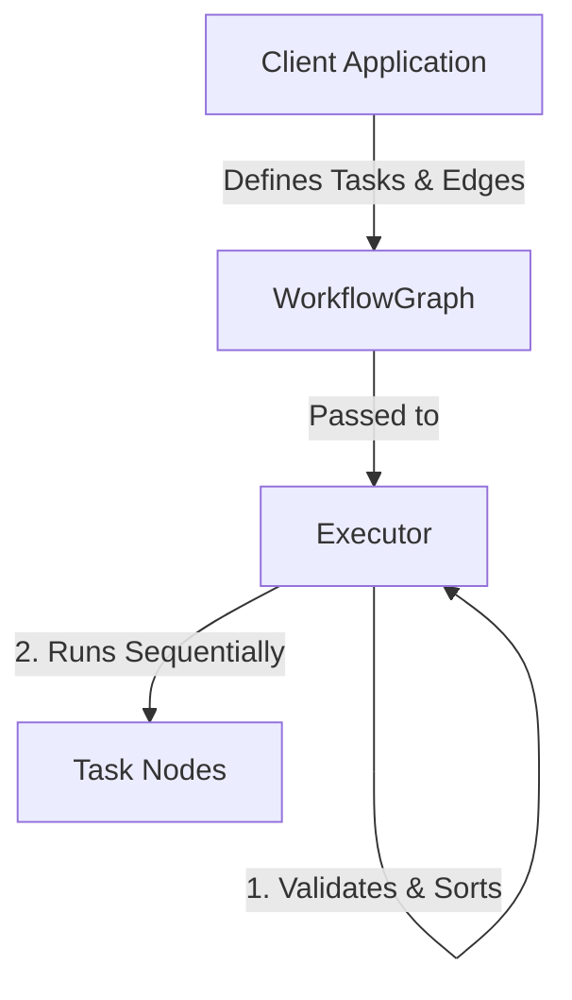

# Architecture

## Overview

FlowKit uses a modular architecture that separates workflow definition from workflow execution. The execution engine is currently single-threaded, while the design preserves the structural guarantees necessary to support a future multi-threaded execution model with minimal architectural changes.

---

## High-Level Component Design



---

## Core Components

### 1. WorkflowGraph

**Responsibility**

- Represents the workflow as a Directed Acyclic Graph (DAG).
- Stores task nodes.
- Maintains directed dependency edges between tasks.

**Validation**

Before execution, the graph validates its structure by performing cycle detection using either:
**(TBD:)**
- Depth-First Search (DFS)
- Kahn's Algorithm
- (Or other)

    Execution is only allowed if the graph is a valid DAG.

---

### 2. Task (Interface)

**Responsibility**

Defines the behavioral contract for executable work units.

**Characteristics**

- Exposes a single execution method:

```c++
execute()
```

- Completely independent from graph mechanics.
- Tasks have no knowledge of neighboring nodes.
- Easily extensible for custom task implementations.

---

### 3. Executor

**Responsibility**

Coordinates the complete workflow lifecycle.

**Execution Steps**

1. Accepts a validated `WorkflowGraph`.
2. Performs topological sorting.
3. Executes tasks sequentially.
4. Tracks execution state.
5. Reports execution failures when encountered.

The executor owns execution logic while the graph remains a pure structural model.

---

## Design Patterns

| Pattern | Usage | Benefit |
|----------|-------|---------|
| Command | Task abstraction | Encapsulates executable actions behind a consistent interface without exposing framework internals. |
| Builder / Fluent API | Workflow construction | Provides a readable and expressive API for defining workflows and linking task dependencies. |

---

## Architectural Decision: Shared Context

The framework intentionally excludes a global, untyped shared context.

### Rationale

Global mutable state introduces several long-term issues:

- Weakens DAG guarantees.
- Couples otherwise independent tasks.
- Creates data-race risks when introducing parallel execution.
- Makes workflows harder to reason about and test.

### Preferred Approach

Data should flow explicitly through:

- Type-safe task inputs and outputs.
- Localized token or message passing between tasks.

This approach keeps task dependencies explicit, improves maintainability, and allows the execution engine to evolve toward safe concurrent execution without redesigning the core architecture.

[← Back to README](../README.md)